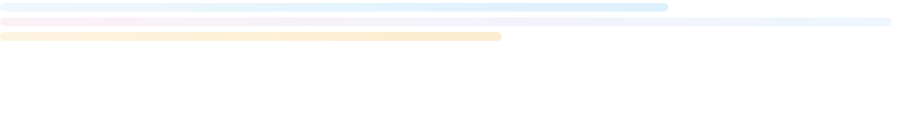

react-chatbar-loader

A lightweight, customizable ChatGPT-style multi-bar skeleton loader for React.
Perfect for chat UIs, AI assistants, messaging apps, and conversational experiences.

🚀 Features

Zero dependencies

Fully customizable gradients & widths

Auto dark-mode support

Pulse & shimmer typing animations

Dynamic bar counts

ESM + CJS builds

TypeScript support

Lightweight and simple

📦 Install

Using npm:
npm install react-chatbar-loader

Using yarn:
yarn add react-chatbar-loader

🧠 Usage

import { LoaderBars } from "react-chatbar-loader";

export default function App() {
return <LoaderBars />;
}

🎨 Customization Examples
🔢 Number of bars
<LoaderBars bars={4} />
🌈 Custom gradients

<LoaderBars
bars={3}
gradients={[
{ from: "#E0F2FE", to: "#BAE6FD" },
{ from: "#FDE3F0", to: "#DCEEFF" },
{ from: "#FFEAC3", to: "#FFDCA0" }
]}
/>

🌙 Dark theme gradients

<LoaderBars
gradients={[
{ from: "#E0F2FE", to: "#BAE6FD" },
{ from: "#FDE3F0", to: "#DCEEFF" }
]}
darkGradients={[
{ from: "#4B5563", to: "#1F2937" },
{ from: "#6B7280", to: "#374151" }
]}
/>

✨ Shimmer typing effect
<LoaderBars shimmer bars={4} />
💓 Pulse skeleton
<LoaderBars pulse />
📏 Custom widths

<LoaderBars widths={["60%", "80%", "45%"]} />

🧩 Props API

Prop	Type	Default	Description
bars	number	3	Number of bars
gradients	Gradient[]	pastel defaults	Light theme gradients
darkGradients	Gradient[]	gray defaults	Dark theme gradients
widths	string[]	random	Width per bar
height	number	12	Bar height in px
radius	number	9999	Border radius (pill)
pulse	boolean	true	Pulse skeleton effect
shimmer	boolean	false	Sliding shimmer animation
speedMs	number	1400	Animation duration
theme	"auto" or "light" or "dark"	auto	Override system theme
className	string	—	Custom CSS
style	CSSProperties	—	Inline styles
Gradient type

type Gradient = { from: string; to: string };

💡 Example: Chat UI Placeholder

function ChatReplyLoader() {
return (

<LoaderBars bars={4} shimmer />

);
}

🔥 Why this exists

Chat UIs feel different from list/data loaders.
This component focuses on:

✔ conversational rhythm
✔ natural motion
✔ variable line lengths
✔ minimal design
✔ brand-friendly customization

It looks alive, like a chatbot typing.

🧱 Build details

dist/index.js → ES module

dist/index.cjs → CommonJS

dist/index.d.ts → TypeScript declarations

Works in Vite, Next.js, CRA, Remix, Webpack

Only peer dependency: React

🛠 Contributing

Ideas welcome!

Additional loader styles

Presets (ChatGPT / Gemini / Claude / Copilot)

Curved shapes

Accessibility improvements

Open PRs or Issues on GitHub.

📜 License

MIT © 2025-present
Aakash Toshniwal

⭐ If you like it

Give the project a star ❤️
It motivates further improvements.

🔗 Links

GitHub: https://github.com/akasht2509/reactChatbotLoader
npm: https://www.npmjs.com/package/react-chatbar-loader